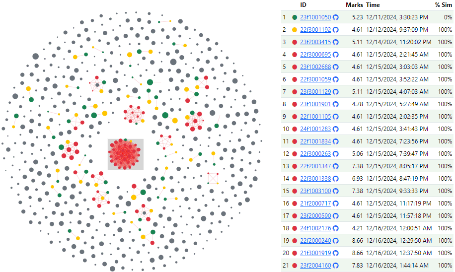
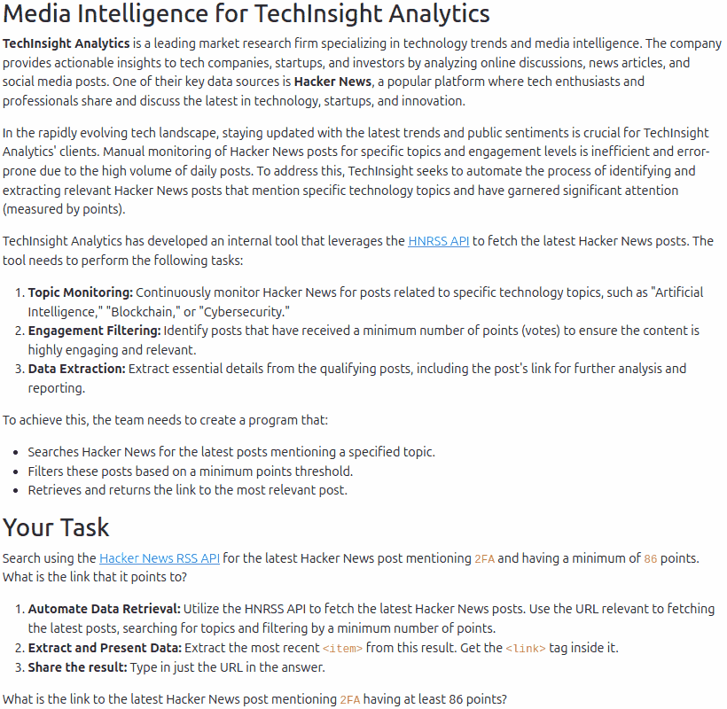

<!-- _backgroundColor: #defa9d -->

# LLMs in Education

### [Anand S](https://s-anand.net/)

###### LLM Psychologist @ Straive

Slides: [sanand0.github.io/llms-in-education](https://sanand0.github.io/llms-in-education)
Generated via a voice conversation with [ChatGPT](https://chatgpt.com/share/67e36f57-01c4-800c-b4fc-5c8b302403f4)

---

## How Do We Use LLMs in Education?

- **LLMs are new**. No one really knows how to use them in education. Let's explore.
- My examples are **starting points**—your thoughts will shape fresh ideas.
- Your inputs and experiments will give me and others new ideas. So please **ask questions and share ideas**—as many as you can.

---

## Opening Questions

1. What benefits and STRUGGLES have students reported in using LLMs while studying?
2. What differences do you see between students who use LLMs actively versus those that do not? (positive and negative)
3. What LLM-based techniques have you tried applying in your courses?

---

## Redesign Curriculum

- [I ask ChatGPT ways to modernize the Tools in Data Science course](https://chatgpt.com/share/67e3fabb-74bc-800c-b71c-6d94de1da612)
- For example, [it suggested emerging topics in CI/CD](https://chatgpt.com/share/67e3f840-fa44-800c-9fc5-afc785a1b273), such as:
  - [GitHub Actions](https://github.com/sanand0/tools-in-data-science-public/blob/tds-2025-01/github-actions.md)
  - [Containers: Docker, Podman](https://github.com/sanand0/tools-in-data-science-public/blob/tds-2025-01/docker.md)
- My courses stay fresh and tech-relevant.

---

## Write Course Content

- Generated content using Cursor with Cloud 3.5 Sonnet.
  - Share previous content. Ask it to replicate style and structure.
- Here are some examples of such content:
  - [FastAPI](https://github.com/sanand0/tools-in-data-science-public/blob/tds-2025-01/fastapi.md)
  - [Bash](https://github.com/sanand0/tools-in-data-science-public/blob/tds-2025-01/bash.md)
  - [Vercel](https://github.com/sanand0/tools-in-data-science-public/blob/tds-2025-01/vercel.md)
- It picks YouTube links that are relevant, popular, and concise!
- Time to create new topic: ~30 minutes (including review + edits)

---

## Automate _Personalized_ Feedback

- We used LLMs to [evaluate code quality](https://github.com/sanand0/tools-in-data-science-public/blob/tds-2024-t3/project-2-automated-analysis.md#code-7-marks)
- The [evaluation script](https://github.com/sanand0/tools-in-data-science-public/blob/tds-2024-t3/project2/evaluate.py#L285-L316) passes the code + criteria to an LLM
- [It provides a reason for each criterion, _and_ a clear yes/no verdict](https://github.com/sanand0/tools-in-data-science-public/blob/tds-2024-t3/project2/evaluate.py#L274-L277).
- [Feedback](https://sanand0.github.io/tds-2024-sep-project-2-results/#?tab=detail&id=22f1000693) is personalized, with specific examples, pros & cons.
- Quality is as good as instructors. Instructors are freed up.

---

## Detect Copying

- [Removed comments and normalized whitespace](https://github.com/sanand0/tools-in-data-science-public/blob/tds-2024-t3/project2/similarity.py#L24-L63).
- [Used overlapping phrases to gauge similarity](https://github.com/sanand0/tools-in-data-science-public/blob/tds-2024-t3/project2/similarity.py#L77-L109).
- [Mapped networks to flag copying](https://www.s-anand.net/blog/when-and-how-to-copy-assignments/).

---

## Copying Insights

- 50% of students didn't copy, though allowed to. They performed the worst.
- Copying late is better than copying early.
- Early sharers (who invited others to copy) excelled

[Read on for more details](https://www.s-anand.net/blog/when-and-how-to-copy-assignments/)

---

## Transcribe Lectures

- We converted all [live sessions into FAQs](https://tds.s-anand.net/#/live-sessions).
- LLMs like Gemini can transcribe, correct & summarise in _one_ step. Quality is improving every day.
- This contributed to a surge in live session attendance.

[See code and prompt used for transcription](https://github.com/sanand0/tools-in-data-science-public/blob/tds-2025-01/live-sessions.md).

---

## Create a Virtual Instructor

- Converted all course materials into Markdown.
- [Trained a custom GPT](https://chatgpt.com/g/g-mZqKVxKDx-iitm-tds-teaching-assistant) on the entire course content.
- Guided it with broad [instructor-style instructions](https://github.com/sanand0/tools-in-data-science-public/blob/tds-2025-01/tds-ta-instructions.md).
- Used a few thousand times, though its impact remains unproven.
- We'd like to integrate it into Discord to answer repeat questions.

---

## Teach Prompt Engineering

> Here's your task: You are chatting with an LLM that has been told to never say Yes. You need to get it to say Yes.
>
> Write a prompt that will get the LLM to say Yes.

[Students explored _very_ creative prompts to bypass safeguard blocks.](https://www.s-anand.net/blog/hacking-an-obnoxious-unhelpful-llm-to-say-yes/)

---

## Add LLM-Powered Projects

- [Assigned a project where LLMs generated code for diverse problem statements](https://github.com/sanand0/tools-in-data-science-public/blob/tds-2024-t3/project-2-automated-analysis.md).
- Students learned how to manage LLMs’ natural unreliability.
- ... and LLMs' ability to handle diverse tasks with few instructions.

---

## Contextualize questions

- Students don't understand relevance of skills.
- [LLMs create real-life use cases to explain questions](https://exam.sanand.workers.dev/tds-2025-01-ga4#hq-hacker-news-search).
- Helped students understand practical relevance of each question.

---

## Things We Are Going To Try

- Evaluate subjective answers with LLMs.
- Analyze student mark distributions.
- Create personalized learning paths and virtual assistants.
- Enable students to craft their own course material.
- Leverage Discourse as a database for repetitive questions.
- Provide live assistance by capturing students’ coding screens.
- Build test cases for evaluations and quizzes.

---

## Discussion & Next Steps

1. Which of the above LLM applications—from curriculum design to automated evaluations—do you believe holds the highest potential to transform learning experiences, and why?
2. Based on our discussion, what ideas come to your mind that you would like to try out?

---

<!-- _backgroundColor: #defa9d -->

## Takeaways for Instructors

- **Modernize Curriculum:**
  add emerging tech trends, and phase out outdated topics.
- **Scale Impact with Automated Feedback:**
  Use AI-driven evaluations & code reviews for detailed, criterion-based feedback.
- **Pilot AI Initiatives:**
  Run experiments. Track engagement. Refine your approach.

Slides: [sanand0.github.io/llms-in-education](https://sanand0.github.io/llms-in-education)

---

<!-- backgroundColor: #f8cccf -->

## 26 Mar 2025, IITM DS Instructors

### How are students using LLMs?

- Blind copy-pasting - leading to misleading confidence
  - E.g. they fail in unfamiliar languages
  - E.g. content that is generic, not course-specific
- Learning approach ignores details like context, fundamentals
- Familiar topics are easier to learn, even with LLMs
- ChatGPT's detailed responses can overwhelm

---

### How are students using LLMs different?

- They're less afraid of challenges
- They don't get foundational concepts and fail on such questions
- They ask fewer questions and collaborate less? (To be validated)
- Naive copy-pasters understand their code less. (But experts get it.)
- Naive users use LLMs for _everything_ leading to lesser problem solving skills. Those who struggle answer new questions better.
- Naive users tend to "overdo" answers. e.g. including irrelevant content. (They don't get that it's irrelevant.)

---

### What LLM ideas are you planning to try?

- (9) Virtual assistant: customized ChatGPT, custom question set
- (9) Automated evaluations + Subjective assignments
- (8) Personalized feedback: on projects
- (7) Transcripts of live sessions: link to video
- (7) Copying analysis to detect plagiarism
- (3) Curriculum redesign
- (1) Automated test cases
